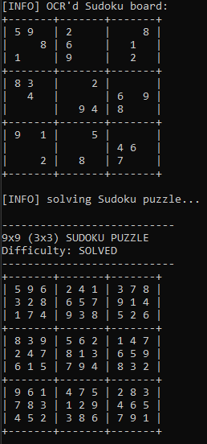
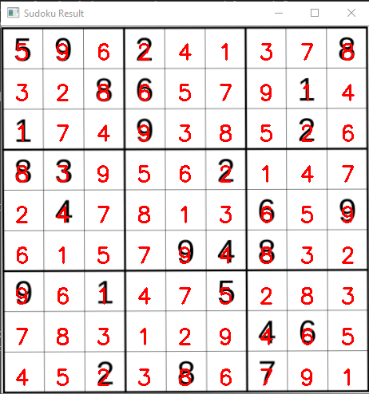

# Image Sudoku Solver with Py-Sudoku, OpenCV and OCR

## Yushan Wang 

This project is using OCR to read a sudoku puzzle from images and solve the puzzle and display the solution.

## Requirement:

> pip install cv2
> pip install py-sudoku

Furthermore, user need to install TensorFlow to run the digit classifier model.

## What is in this Repo:

The folder 'pdfs' contained in the initial sudoku puzzle books and solutions with three difficult levels: Easy, Medium, Difficult

The folder data_preprocess contained the codes to process the pdf files to single puzzle images. All those single puzzle images are stored in sudoku_data

The images of solutions are stored in solution_data folder.

The puzzle.py contains the code of how to localize the sudoku puzzle in the image and how to extract the ROI (Region Of Interest) of the digit in the puzzle.

The digit_classifier.h5 is the OCR model trained with MINST dataset. This model could decrypt the digits in the sudoku puzzle image.

## How to run this Sudoku Solver:

First of all, you need to clone the folder to your computer either using

> git clone 

or directly download the repo and unzip the folder.

After the repo is downloaded, one need type the following command in the python terminal:

python puzzle_solver.py

and you will see the Starting INFO:

> [Start INFO] Welcome to Yushan's Sudoku OCR Solver.
> [Start INFO] There are 3 levels of diffculty of puzzles could be chosen:
> [Start INFO] Easy : 1
> [Start INFO] Medium : 2
> [Start INFO] Difficult : 3
> [Start INFO] Enter difficulty Level: 

you should type number between 1 and 3 to select difficulty level.

Below is an example output

